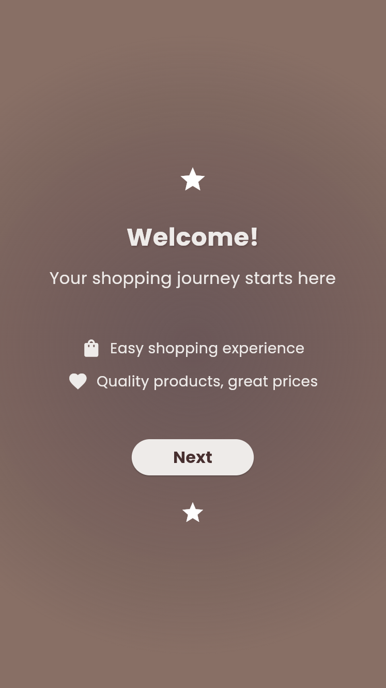
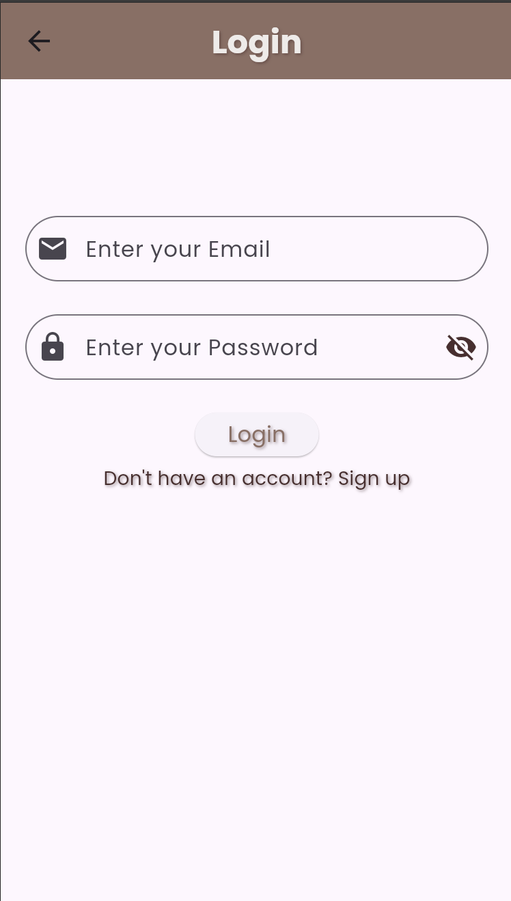
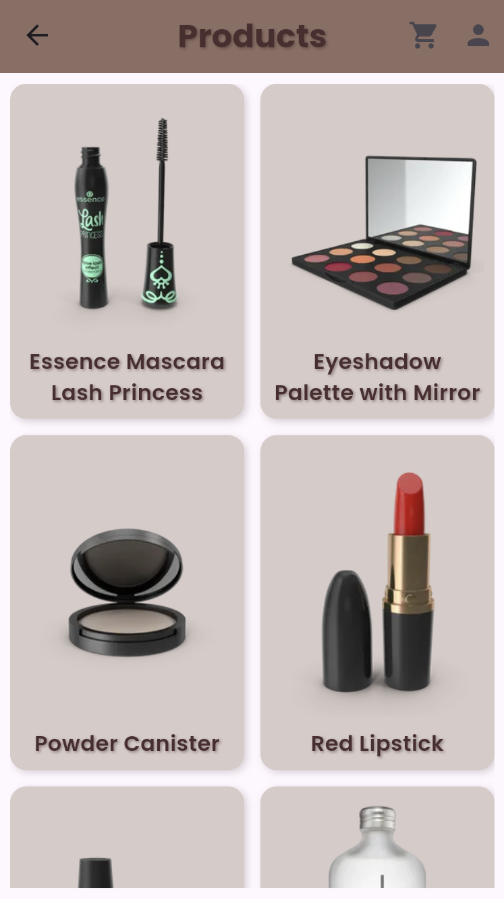
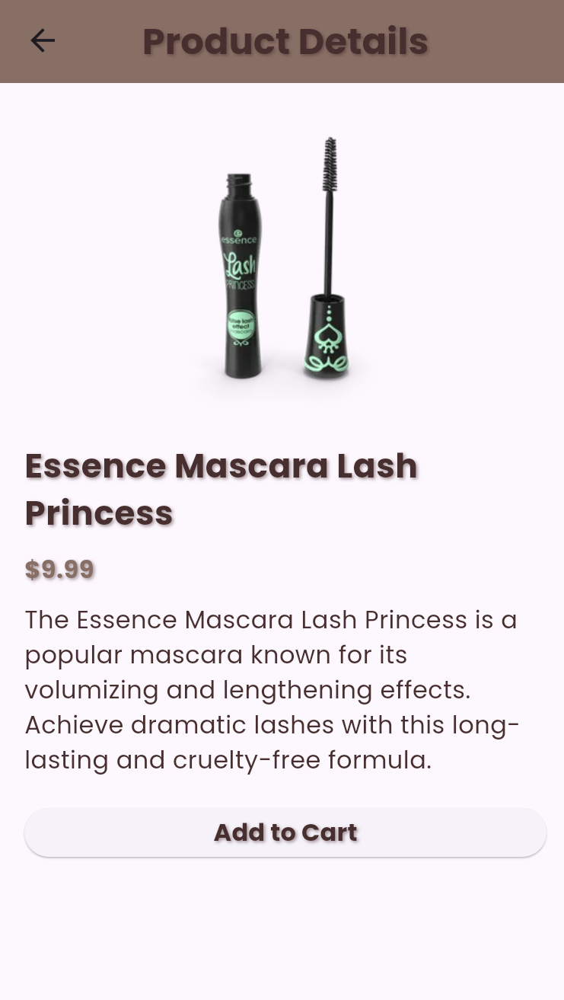
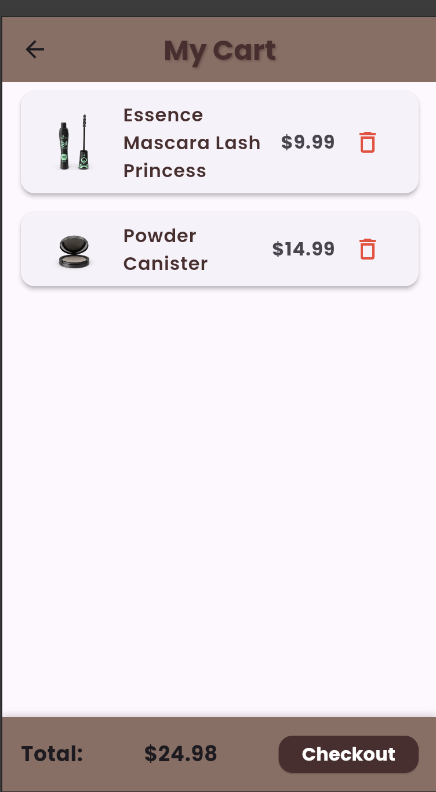

# hw_day8

A new Flutter project.

# 📱 Project Description:

This project is a Flutter shopping application that allows users to browse products,
view product details, and manage their shopping experience smoothly.

The app uses Supabase as a backend service for authentication and database management,
providing secure login and real-time data handling.

# 📸 App Screenshots:

# 🗄️ Database (Supabase):

The following screenshot shows the database table structure used in Supabase.

